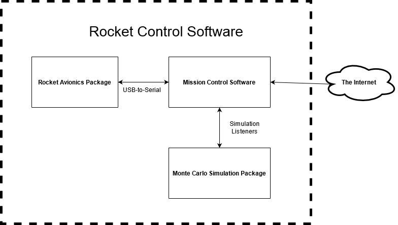

### Client

Our client is Andre Geldenhuis, and he can be contacted via the ecs mattermost, or via email at andre.geldenhuis@vuw.ac.nz.

### 1.1 Purpose

Andre has contracted us to create mission control software for a hobby rocket launch, control, and recovery system. 

### 1.2 Scope

The Mission Control Software is a multirole software package that facilitates pre-launch, mid-launch, and post-launch activities.
It will identify favorable launch conditions, set the starting conditions for a rocket launch. 
During a launch it will monitor the rocket, reporting its status and position.
After the launch it will report the rockets position for manual recovery. 
This software will facilitate the goal of making hobby rocket launches safer for both the users and the community, as well as aiding in convenience tasks like recovery.

### 1.3 Product overview 
#### 1.3.1 Product perspective

The Mission Control Software is part of a larger software system to facilitate the launch and control of a hobby rocket.
The Mission Control Software will interface with both the user and two other software packages, namely the Monte Carlo Simulation Package and the Rocket Avionics Package.
The role of the Mission Control Software is to find potential launching sites, facilitate pre-launch procedures such as arming the rocket and finding an optimal
launch profile. The control of the rocket mid flight is handled by the Rocket Avionics Package and the simulation of rocket flights is handled by the Monte Carlo
Simulation package, respectively. The Mission Control Software will have to interface with those software packages to fulfill its functions.

Specifically:

* The MCS will have to interface with the Rocket Avionics Package to get the real-time position of the rocket to facilitate tracking and recovery
* The MCS will have to interface with the Rocket Avionics Package to arm the ejection charge and set the desired rocket orientation
* The MCS will have to interface with the Monte Carlo Simulation Package to identify probable landing sites to facilitate screening possible launch sites.

The Mission Control Software will integrate with the Rocket Avionics Package and the Monte Carlo Simulation Package using USB Serial over radio and Java Simulation
Listeners with OpenRocket, respectively.

To interface with the Monte Carlo Simulation Package, the following software packages will be required:

| Name | Mnemonic | Version | Source | Purpose |
| ------ | ------ | ------ | ------ | ------ |
| Java Runtime Environment | JRE | 1.8 or later | Oracle | Creating environment for MCS, dependency for OpenRocket |
| OpenRocket | OR | Version 15 | OpenRocket | Creating environment for Monte Carlo Simulation Package |

The interface with OpenRocket/Monte Carlo Simulation Package will be through simulation listeners and the automatic creation of simulation files, which are in XML.

The Mission Control Software will operate on a PC with the Java VM running any major operating system, most likely a laptop. It'll require enough free memory and 
processor capacity to run both the Mission Control Software and the Monte Carlo Simuation Package, which would likely amount to 2GB (not accounting for memory used
by the operating system) and a dual core x86 processor (additional capacity may be required on an ARM platform).

The PC must also have one free USB port to operate the serial over radio interface. The PC must also have a standard keyboard/pointing device combo to operate the
Mission Control Software. The Mission Control Software will be a standard desktop application which can operate at full or half-screen.

Communication with the internet is required for the pre-launch site determination, as the Mission Control Software needs to download weather data from NOAA to facilitate
creating simulations for the Monte Carlo Simulation Package.

The Mission Control Software will also be indirectly be interfacing with a device that gathers local weather conditions, which the users of the software will use
and manually transcribe the data into the software via the user interface.
